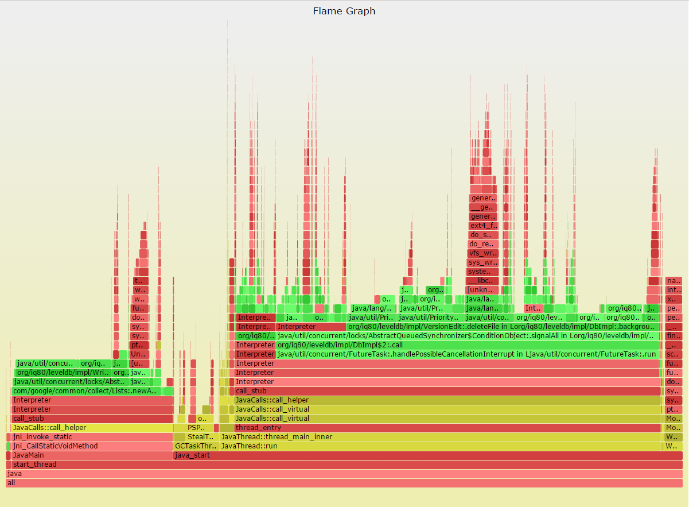

# PerfJ

`PerfJ` is a wrapper of linux `perf` for java programs.

As [Brendan Gregg's words](http://www.brendangregg.com/FlameGraphs/cpuflamegraphs.html#Java)

>In order to profile java programs, you need a profiler that can sample stack traces. There has historically been two types of profilers:

>* `System profilers:` like Linux perf, which shows system code paths (eg, JVM GC, syscalls, TCP), but not Java methods.
>* `JVM profilers:` like hprof, LJP, and commercial profilers. These show Java methods, but usually not system code paths.

>Ideally, we need a profile result that does it all: system and Java code paths. Apart from convenience, it also shows system code-paths in Java context, which can be crucial for understanding a profile properly.

>The problem is getting a system profiler to understand Java methods and stack traces. If you try Linux perf_events, for example, you'll see hexadecimal numbers and broken stack traces, as it can't convert addresses into Java symbols, and can't walk the JVM stack.

>There are two specific problems:

>* The JVM compiles methods on the fly (just-in-time: JIT), and doesn't expose a traditional symbol table for system profilers to read.
>* The JVM also uses the frame pointer register (RBP on x86-64) as a general purpose register, breaking traditional stack walking.

Thanks to [the work by Brendan Gregg and Zoltan Majo](https://bugs.openjdk.java.net/browse/JDK-8068945). We will have an option to turn on the preservation of frame pointer on JDK 8u60+.

This project is based on Johannes Rudolph's work at [here](https://github.com/jrudolph/perf-map-agent), but `PerfJ` is more convenient and safer to use.

`PerfJ` can produce flame graph through [Brendan Gregg's FlameGraph tool](https://github.com/brendangregg/FlameGraph) .

Below is an example shows the hotspot of a pure java [leveldb](https://github.com/dain/leveldb) program. Green is Java layer, yellow is JVM layer, and red is system layer(native user-level, or kernel). Longer bar means higher cpu percentage.

There is a raw interactive SVG image [here] (http://blog.minzhou.info/perfj/perfj.svg).

## Prerequisites

* Linux x86_64
* perf
* JDK 8u60 and higher

## Build

Before starting building `PerfJ`, make sure `gcc` is already installed.

checkout the source from github

    git clone https://github.com/coderplay/perfj.git

and run below in the future building

    cd perfj
    ./gradlew releaseTarGz

## Installation

Before install `PerfJ`, you should install Linux perf first

To install perf on centos/redhat/fedora linux system

    yum install perf.x86_64

To install perf on ubuntu linux system

    apt-get install linux-tools-common linux-tools-generic linux-tools-`uname -r`

then download `perfj-*.tgz` from the [release page] (https://github.com/coderplay/perfj/releases),  untar it

    tar zxvf perf-*.tgz

## Usage

Check the [wiki pages] (https://github.com/coderplay/perfj/wiki)

## License

This library is licensed under GPLv2. See the LICENSE file.
